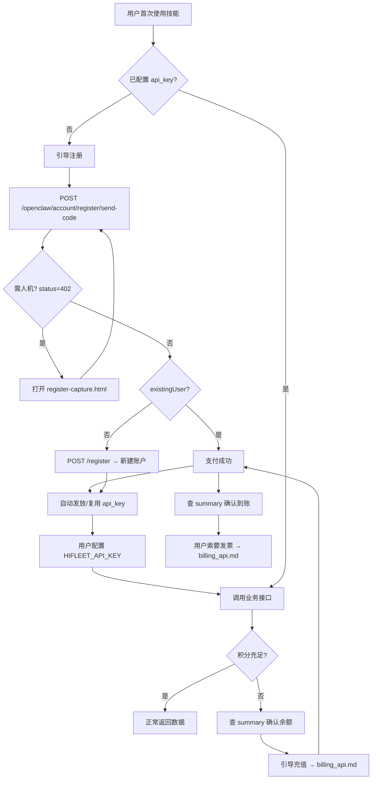
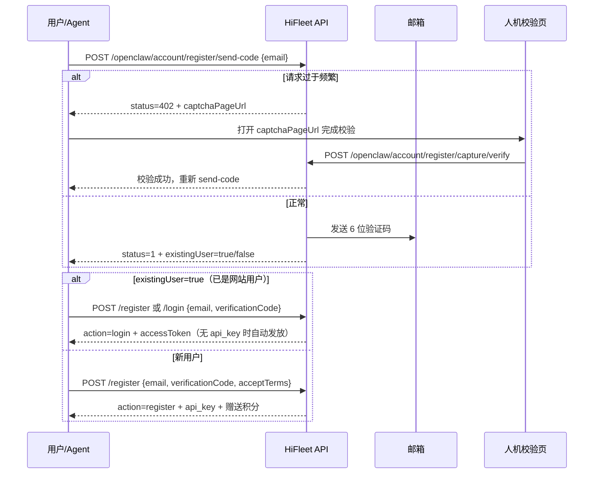

# 账户入门 API / Account Onboarding API

> **状态**：**已实现**

**API 基址**：`{base}`（默认 `https://api.hifleet.com`）；见 [api_base.md](api_base.md)。

**已实现**（可立即调用）：积分查询类接口见 [account_api.md](account_api.md)。

---

## 全链路概览



| 阶段 | 用户意图 | Agent 动作 | 文档 |
|------|----------|------------|------|
| 0. 无 Key | 怎么用、没 Key、注册 | 读 [FIRST_SETUP.md](../FIRST_SETUP.md)，引导注册 | 本文 §1 |
| 1. 入门 | 注册、登录、申请 Key | send-code →（按需人机）→ 验证码校验 → register/login（**免密码**） | 本文 §1 |
| 2. 获 Key | 我的 Key、重新获取 | 登录后查 Key 列表；**完整 Key 仅创建时返回一次** | 本文 §2 |
| 3. 使用 | 查船位、PSC 等 | 检查 `HIFLEET_API_KEY` → 调业务接口 | 各业务分册 |
| 4. 余额不足 | 积分不够、扣费失败 | 先 `account/summary` → 引导充值 | [billing_api.md](billing_api.md) |
| 5. 付费后 | 充值、开发票 | 查订单状态 → 列发票 / 下载 PDF | [billing_api.md](billing_api.md) |

---

## Agent 路由（必守）

| 用户说什么 | 优先动作 |
|------------|----------|
| 注册、开户、新用户、申请 api_key | 先 **send-code**；`existingUser=true` 时校验后直接登录；否则 **register**（免密码） |
| 登录、已有账户 | 先 **send-code**，再 **login** 或 **register** 携带 `verificationCode`（免密码） |
| 我的 api_key、查看密钥 | 本文 **§2**；**禁止**在对话中粘贴完整 Key，仅展示 `tokenPrefix` + `tokenLast4` |
| 没积分、余额不足、充值、订阅、付费、买票 | [billing_api.md](billing_api.md) |
| 发票、开票、报销 | [billing_api.md](billing_api.md) §4 |
| 还剩多少积分、调用记录 | [account_api.md](account_api.md)（已实现） |
| 打开控制台、看用量页、钱包、用 api_key 登录 | [console_sso_api.md](console_sso_api.md)（换票，勿再走验证码登录） |

**禁止**：伪造注册结果、api_key、支付链接或发票信息。

---

## 1. 注册与登录

### 1.0 登录/注册流程（免密码，邮箱或手机号）

> **核心规则**：OpenClaw **不需要用户设置密码**。验证码支持 **邮箱** 与 **手机号** 两种方式；已是 HiFleet 网站用户则校验后直接登录，**不会重复注册**。

| 通道 | 发码接口 | 说明 |
|------|----------|------|
| 邮箱 | `POST /openclaw/account/register/send-code` Body: `{ "channel":"email", "email":"..." }` | 发邮件验证码 |
| 手机 | 同上 Body: `{ "channel":"phone", "phone":"138..." }` | 发短信验证码 |
| 手机（兼容） | `GET/POST /openclaw/account/sms/register?phone=...` | 同发短信；一般直接传明文 `phone` 即可 |



| 步骤 | 接口 | 说明 |
|------|------|------|
| ① 发码 | `POST /openclaw/account/register/send-code` | **邮箱或手机号**；返回 `channel`、`existingUser`；超限 **402** |
| ② 人机（按需） | 打开响应中的 `captchaPageUrl` | 用户在页面完成校验后，再重新调 send-code |
| ③ 校验 | `POST /openclaw/account/register` 或 `/login` | 仅须 `email`/`phone` + `verificationCode`；已是网站用户 → **登录**，否则 → **注册** |

**防刷提示**（Agent 侧）：同一邮箱/手机或同一出口 IP 发码过频时，接口会返回 `status=402` 并带 `captchaPageUrl`；请引导用户打开该页完成校验，**不要**自行绕过或伪造校验结果。

---

### 1.0.1 发送登录/注册邮箱验证码

| 项目 | 值 |
|------|-----|
| URL | `{base}/openclaw/account/register/send-code` |
| 方法 | `POST` |
| Content-Type | `application/json` |
| 鉴权 | 无 |

**请求 Body**

| 字段 | 必填 | 说明 |
|------|------|------|
| `channel` | 否 | `email`（默认）或 `phone` |
| `email` | 邮箱通道必填 | 邮箱 |
| `phone` / `mobile` | 手机通道必填 | 明文手机号（推荐） |

**成功响应** `status=1`

| 字段 | 说明 |
|------|------|
| `data.channel` | `email` 或 `phone` |
| `data.email` / `data.phone` | 发送目标 |
| `data.existingUser` | `true` = 已是 HiFleet 网站用户，校验后将**直接登录** |
| `data.expiresInSeconds` | 验证码有效期（默认 1800 秒） |
| `data.agentSummary` | 可直接转述 |

**需人机校验** `status=402`（HTTP 仍 200）

| 字段 | 说明 |
|------|------|
| `data.captchaRequired` | `true` |
| `data.captchaPageUrl` | 人机校验页地址（须引导用户打开） |
| `data.captchaVerifyUrl` | 校验完成页回调用（页面内使用，Agent 一般无需直接调） |
| `data.agentSummary` | 引导用户打开人机页，完成后重新 send-code |

**Agent 话术（402）**：请用户打开 `captchaPageUrl` 完成人机校验，成功后再调用 send-code。

---

### 1.1 验证码注册 / 登录（免密码）

提交验证码后，接口根据 `existingUser` 自动走登录或注册：

- **`existingUser=false`**：注册新账户，发放默认 `api_key` 与新手赠送积分（`action=register`）。
- **`existingUser=true`**：不重复注册，直接登录并返回 `accessToken`（`action=login`）；若无有效 `api_key` 则自动发放（不重复赠送积分）。
| 项目 | 值 |
|------|-----|
| URL | `{base}/openclaw/account/register`（新用户）或 `{base}/openclaw/account/login`（已有用户，二选一） |
| 方法 | `POST` |
| Content-Type | `application/json` |
| 鉴权 | 无 |

**请求 Body**

| 字段 | 必填 | 类型 | 说明 |
|------|------|------|------|
| `channel` | 否 | string | `email` 或 `phone` |
| `email` | 邮箱通道必填 | string | 邮箱 |
| `phone` / `mobile` | 手机通道必填 | string | 明文手机号 |
| `verificationCode` | 是 | string | 验证码 |
| `companyName` | 否 | string | 公司/组织名称（仅新用户，发票抬头可复用） |
| `contactName` | 否 | string | 联系人姓名（仅新用户） |
| `phone` | 否 | string | 手机号（仅新用户） |
| `acceptTerms` | 新用户必填 | boolean | 须为 `true`；已有网站用户登录时可省略 |

**请求示例（新用户）**

```json
{
  "email": "broker@example.com",
  "verificationCode": "123456",
  "companyName": "示例航运有限公司",
  "contactName": "张三",
  "acceptTerms": true
}
```

**请求示例（手机号新用户）**

> 手机通道下，账户标识即为手机号本身（如 `13800138000`）。

```json
{
  "channel": "phone",
  "phone": "13800138000",
  "verificationCode": "123456",
  "acceptTerms": true
}
```

**请求示例（手机号老用户登录）**

```json
{
  "channel": "phone",
  "phone": "13800138000",
  "verificationCode": "123456"
}
```

**成功响应** `status=1`

| 字段 | 说明 |
|------|------|
| `data.action` | `register` 或 `login` |
| `data.existingUser` | 是否已是网站用户 |
| `data.registered` | 本次是否新建账户（`action=register` 时为 `true`） |
| `data.userId` | 用户 ID |
| `data.email` | 邮箱 |
| `data.accessToken` | 账户管理用短期令牌（JWT） |
| `data.apiKey` | 默认 api_key（**仅首次发放时返回完整值**） |
| `data.apiKeyId` | Key 记录 ID |
| `data.tokenPrefix` / `data.tokenLast4` | Key 脱敏展示 |
| `data.hasApiKey` | 是否已有有效 Key |
| `data.welcomeBonusPoints` | 仅新用户注册赠送积分 |
| `data.availablePoints` | 当前可用积分（新用户或首次发放 Key 时） |
| `data.agentSummary` | 可直接转述 |
| `data.setupHint` | 配置 `HIFLEET_API_KEY` 提示 |

**失败响应**

| code | 说明 |
|------|------|
| `4102` | 邮箱格式无效 |
| `4104` | 未接受服务条款（仅新用户） |
| `4105` | 手机号格式无效 |
| `4106` | 账号尚未注册（login 验证码时） |
| `4107` | 未提供邮箱或手机号 |
| `4111` | 验证码已过期 |
| `4112` | 验证码错误 |
| `4113` | 未获取/未校验验证码 |
| `4114` | 需先完成人机校验（send-code 返回 402） |
| `4115` | 当日请求次数达上限 |

**Agent 话术（成功）**

1. 朗读 `agentSummary`；`action=login` 时说明「已是 HiFleet 用户，已为您登录」。  
2. 若返回了 `apiKey`：**完整 Key 仅显示一次**，请用户配置 `HIFLEET_API_KEY`。  
3. 新用户说明赠送积分；老用户登录无重复赠送。  
4. 后续对话只展示 `tokenPrefix`…`tokenLast4`。

---

### 1.2 登录（验证码或密码）

已注册用户获取 `accessToken`，用于账户管理（查 Key 列表、发起充值等）。**推荐验证码登录（免密码）**；仍兼容网站既有密码。

| 项目 | 值 |
|------|-----|
| URL | `{base}/openclaw/account/login` |
| 方法 | `POST` |
| Content-Type | `application/json` |

**请求 Body（推荐：验证码）**

| 字段 | 必填 | 说明 |
|------|------|------|
| `email` | 是 | 注册邮箱 |
| `verificationCode` | 是 | 先调 send-code 获取 |

**请求 Body（可选：密码，兼容旧站账户）**

| 字段 | 必填 | 说明 |
|------|------|------|
| `email` | 是 | 注册邮箱 |
| `password` | 是 | 网站账户密码 |

**成功响应 `data`**

| 字段 | 说明 |
|------|------|
| `accessToken` | 账户管理令牌 |
| `refreshToken` | 刷新令牌（可选） |
| `userId` / `email` | 用户信息 |
| `hasApiKey` | 是否已有有效 Key |
| `agentSummary` | 摘要 |

---

### 1.3 重置密码（待实现）

| 项目 | 值 |
|------|-----|
| 申请重置 | `POST {base}/openclaw/account/password/forgot` Body: `{ "email" }` |
| 提交新密码 | `POST {base}/openclaw/account/password/reset` Body: `{ "token", "password", "confirmPassword" }` |

重置 **不影响** 已有 `api_key`；若用户怀疑 Key 泄露，应引导 **轮换 Key**（§2.3）。

---

### 1.4 邮箱验证（可选，待实现）

| 项目 | 值 |
|------|-----|
| 重发验证邮件 | `POST {base}/openclaw/account/email/resend` Header: `Authorization: Bearer {accessToken}` |
| 验证 | `GET {base}/openclaw/account/email/verify?token={token}` |

未验证邮箱：**可调用接口但不可充值**（`code=4201`）；Agent 应提示先完成邮箱验证。

---

## 2. api_key 管理（待实现）

### 2.1 查询 Key 列表

| 项目 | 值 |
|------|-----|
| URL | `{base}/openclaw/account/api-keys` |
| 方法 | `GET` |
| 鉴权 | `Authorization: Bearer {accessToken}` **或** `api_key`（仅能查当前 Key 自身） |

**响应 `data.items[]`**

| 字段 | 说明 |
|------|------|
| `id` | Key ID |
| `name` | 备注名，如「默认 Key」 |
| `tokenPrefix` / `tokenLast4` | 脱敏展示 |
| `status` | `ACTIVE` / `REVOKED` / `EXPIRED` |
| `createdAt` | 创建时间 |
| `lastUsedAt` | 最近使用时间 |

**禁止**返回完整 Key 字符串（注册/轮换时除外）。

---

### 2.2 创建额外 Key（待实现）

| 项目 | 值 |
|------|-----|
| URL | `{base}/openclaw/account/api-keys` |
| 方法 | `POST` |
| 鉴权 | `Authorization: Bearer {accessToken}` |

**请求 Body**：`{ "name": "CI 流水线" }`

**成功响应**：含 **完整 `apiKey`（仅一次）** 及 `tokenPrefix` / `tokenLast4`。

---

### 2.3 轮换 / 吊销 Key（待实现）

| 操作 | URL | 方法 |
|------|-----|------|
| 轮换（旧 Key 立即失效，返回新 Key） | `{base}/openclaw/account/api-keys/{id}/rotate` | `POST` |
| 吊销 | `{base}/openclaw/account/api-keys/{id}/revoke` | `POST` |

轮换成功后提示用户更新 `HIFLEET_API_KEY`。

---

## 3. 积分不足时的检测与引导

### 3.1 主动查询（推荐）

任意业务调用前或用户抱怨「不能用」时，先调已实现接口：

```bash
curl -s "{base}/openclaw/account/summary" -H "x-api-key: $HIFLEET_API_KEY"
```

当 **`availablePoints <= 0`**（或用户明确问余额）→ 先调 `GET /openclaw/billing/subscription` 判断是否为订阅周期额度用尽，再进入充值或续订引导，见 [billing_api.md](billing_api.md)。

### 3.2 业务接口错误码（待统一）

业务接口在积分不足时建议返回：

| HTTP | code | 含义 | Agent 动作 |
|------|------|------|------------|
| 402 | `4021` | 积分不足 | 调 `summary` 确认 → 引导充值 |
| 402 | `4022` | 有待入账消耗导致暂不可用 | 说明 `pendingDeduction`，建议稍后或充值 |
| 403 | `4001` | 无该接口权限 | 提示开通对应产品权限，非充值问题 |
| 401 | `4004` | api_key 无效 | 引导检查配置或重新登录获取 Key |

**Agent 话术（积分不足）**

> 您当前可用积分为 **{availablePoints}**，不足以完成本次查询。我可以帮您查看积分充值或订阅套餐并生成收银台付款链接，支付成功后即可继续使用。需要现在查看套餐吗？

然后按 [billing_api.md](billing_api.md) §1～§3 执行。

---

## 4. 配置 api_key（注册后必做）

用户获得 `api_key` 后，任选一种方式配置：

**环境变量（推荐）**

```bash
export HIFLEET_API_KEY="sk_live_xxxxxxxx"
```

**项目 config.json**（租船等分册）

```json
{
  "hifleet_api_key": "sk_live_xxxxxxxx"
}
```

配置完成后，可用已实现接口验证：

```bash
curl -s "{base}/openclaw/account/summary" -H "x-api-key: $HIFLEET_API_KEY"
```

---

## 5. 错误码汇总（账户入门）

| code | 场景 |
|------|------|
| `4004` | api_key 无效或不存在 |
| `4005` | 未携带 api_key |
| `4101` | 邮箱已注册 |
| `4102` | 邮箱格式无效 |
| `4103` | 密码强度不足 |
| `4201` | 邮箱未验证，不可充值 |
| `4021` | 积分不足 |
| `4111`～`4115` | 注册验证码/人机/限流 |

---
