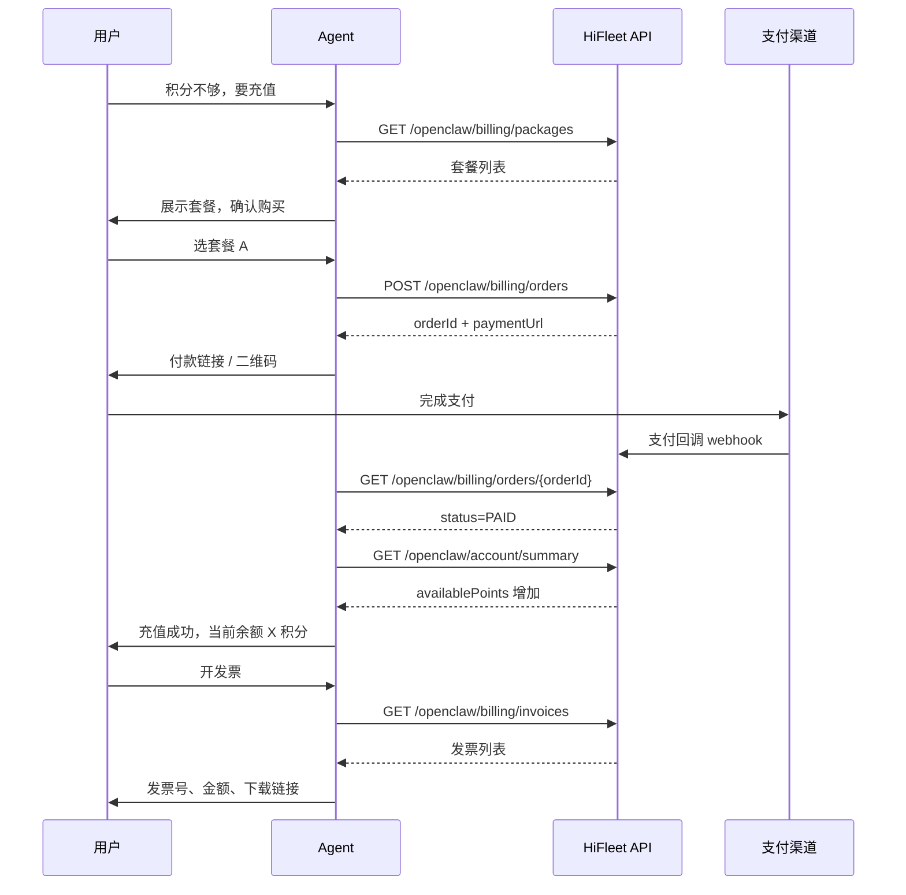

# 计费与发票 API / Billing & Invoice API

> **状态**：**已在 `hifleet.data.api` 实现**（`OpenclawBillingController` / `OpenclawBillingService`）。支付对接 HiFleetOLWeb03 收银台（`CreatePurchasePointsPayment.do` + 微信二维码），回调入账 `user_point_account`。  
> **前置**：用户须已注册并持有 `api_key`，见 [account_onboarding_api.md](account_onboarding_api.md)。

**API 基址**：`{base}`（默认 `https://api.hifleet.com`）。

**鉴权方式**（二选一，待实现时择一或同时支持）：

| 方式 | 适用 |
|------|------|
| `api_key`（Query / Header / Bearer） | OpenClaw Agent 主路径；与业务接口一致 |
| `Authorization: Bearer {accessToken}` | Web 控制台、需更高权限的操作（如修改发票抬头） |

**已实现**：到账后可用 [account_api.md](account_api.md) 的 `summary` / `transactions` 核对积分。

---

## 全链路概览



---

## Agent 路由（必守）

| 用户意图 | 接口 | 说明 |
|----------|------|------|
| 充值、买积分、套餐、多少钱 | `GET /openclaw/billing/packages` | 先展示套餐，**勿**编造价格 |
| 买 XX 套餐、下单 | `POST /openclaw/billing/orders` | 返回 `paymentUrl` 或 `qrCodeUrl` |
| 付了吗、订单状态 | `GET /openclaw/billing/orders/{orderId}` | `PENDING` / `PAID` / `EXPIRED` / `FAILED` |
| 到账了吗 | `GET /openclaw/account/summary` + `transactions` | 以 `availablePoints` 与 `direction=IN` 流水为准 |
| 发票、开票、报销凭证 | `GET /openclaw/billing/invoices` | 仅 `PAID` 订单可开票 |
| 下载发票 PDF | `GET /openclaw/billing/invoices/{id}/download` | 返回 PDF URL 或二进制 |

**积分不足入口**：业务接口返回 `code=4021` 或 `summary.availablePoints <= 0` 时，按上表引导充值。详见 [account_onboarding_api.md](account_onboarding_api.md) §3。

---

## 1. 充值套餐列表

| 项目 | 值 |
|------|-----|
| URL | `{base}/openclaw/billing/packages` |
| 方法 | `GET` |
| 鉴权 | `api_key` 或 `accessToken` |

**Query（可选）**

| 参数 | 说明 |
|------|------|
| `locale` | `zh` / `en`，默认跟用户 locale |
| `currency` | `CNY` / `USD`，默认 `CNY` |

**响应 `data`**

| 字段 | 说明 |
|------|------|
| `agentSummary` | 套餐页自然语言摘要 |
| `items[]` | 套餐列表 |

**`items[]` 单条字段**

| 字段 | 说明 |
|------|------|
| `packageId` | 套餐 ID，下单时使用 |
| `name` / `nameEn` | 套餐名称 |
| `points` | 购买到账积分 |
| `bonusPoints` | 赠送积分（可选） |
| `totalPoints` | `points + bonusPoints` |
| `price` | 标价金额 |
| `currency` | 币种 |
| `priceDisplay` | 格式化展示，如「¥99.00」 |
| `description` | 说明文案 |
| `recommended` | 是否推荐套餐 |
| `itemSummary` | 单条自然语言摘要 |

**响应示例（节选）**

```json
{
  "status": "1",
  "data": {
    "agentSummary": "当前有 3 档积分套餐，推荐「标准包」含 10000 积分赠 500，售价 ¥99。",
    "items": [
      {
        "packageId": "pkg_starter",
        "name": "入门包",
        "points": 1000,
        "bonusPoints": 0,
        "totalPoints": 1000,
        "price": 19.9,
        "currency": "CNY",
        "priceDisplay": "¥19.90",
        "recommended": false,
        "itemSummary": "入门包：1000 积分，¥19.90"
      },
      {
        "packageId": "pkg_standard",
        "name": "标准包",
        "points": 10000,
        "bonusPoints": 500,
        "totalPoints": 10500,
        "price": 99.0,
        "currency": "CNY",
        "priceDisplay": "¥99.00",
        "recommended": true,
        "itemSummary": "标准包：10500 积分（含赠送 500），¥99.00"
      }
    ]
  }
}
```

---

## 2. 创建充值订单

| 项目 | 值 |
|------|-----|
| URL | `{base}/openclaw/billing/orders` |
| 方法 | `POST` |
| Content-Type | `application/json` |
| 鉴权 | `api_key` 或 `accessToken` |

**请求 Body**

| 字段 | 必填 | 说明 |
|------|------|------|
| `packageId` | 是 | 来自 §1 的 `packageId` |
| `paymentChannel` | 否 | `ALIPAY` / `WECHAT` / `BANK_TRANSFER` / `STRIPE`；默认由服务端按 locale 推荐 |
| `returnUrl` | 否 | 支付完成后浏览器跳转地址（Web 场景） |
| `clientType` | 否 | `WEB` / `MOBILE` / `AGENT`，默认 `AGENT` |

**成功响应 `data`**

| 字段 | 说明 |
|------|------|
| `orderId` | 订单号 |
| `status` | 初始为 `PENDING` |
| `packageId` / `packageName` | 套餐信息 |
| `totalPoints` | 支付成功后将入账积分 |
| `amount` / `currency` / `amountDisplay` | 应付金额 |
| `paymentChannel` | 实际支付渠道 |
| `paymentUrl` | H5 / Web 收银台链接（Agent 可直接发给用户） |
| `qrCodeUrl` | 扫码支付二维码图片 URL（微信/支付宝） |
| `expiresAt` | 订单过期时间（通常 15～30 分钟） |
| `agentSummary` | 含付款指引的自然语言摘要 |

**失败响应**

| code | 说明 |
|------|------|
| `4201` | 邮箱未验证，须先验证再充值 |
| `4301` | 套餐不存在或已下架 |
| `4302` | 存在未支付订单，须先支付或取消 |
| `4303` | 支付渠道不可用 |

**Agent 话术（下单成功）**

> 已为您创建订单 **{orderId}**，应付 **{amountDisplay}**，到账 **{totalPoints}** 积分。  
> 请点击付款链接完成支付：[paymentUrl]  
> （或：请使用微信/支付宝扫描下方二维码）  
> 支付完成后告诉我，我会帮您确认到账。

**禁止**伪造 `paymentUrl`；须来自接口响应。

---

## 3. 查询订单状态

| 项目 | 值 |
|------|-----|
| URL | `{base}/openclaw/billing/orders/{orderId}` |
| 方法 | `GET` |
| 鉴权 | `api_key` 或 `accessToken` |

**响应 `data` 主要字段**

| 字段 | 说明 |
|------|------|
| `orderId` | 订单号 |
| `status` | 见下表 |
| `paidAt` | 支付成功时间（`PAID` 时有值） |
| `totalPoints` | 到账积分 |
| `amount` / `amountDisplay` | 实付金额 |
| `paymentChannel` | 支付渠道 |
| `invoiceStatus` | `NONE` / `AVAILABLE` / `ISSUED` |
| `invoiceId` | 已开票时的发票 ID |
| `agentSummary` | 状态摘要 |

**订单状态**

| status | 含义 | Agent 动作 |
|--------|------|------------|
| `PENDING` | 待支付 | 提醒用户付款或重新获取 `paymentUrl` |
| `PAID` | 已支付 | 调 `account/summary` 确认余额；询问是否要发票 |
| `EXPIRED` | 已过期 | 建议重新下单 |
| `FAILED` | 支付失败 | 说明原因，建议重试或换渠道 |
| `REFUNDED` | 已退款 | 说明积分已扣回，查 `transactions` |

**订单列表（可选）**

`GET {base}/openclaw/billing/orders?limit=20&status=PAID`

---

## 4. 发票

### 4.1 发票抬头管理

首次开票前可设置抬头（企业须填税号）。

| 项目 | 值 |
|------|-----|
| 查询抬头 | `GET {base}/openclaw/billing/invoice-profile` |
| 保存抬头 | `PUT {base}/openclaw/billing/invoice-profile` |

**`PUT` Body 示例**

```json
{
  "invoiceType": "COMPANY",
  "title": "示例航运有限公司",
  "taxId": "91310000MA1XXXXXXX",
  "address": "上海市浦东新区…",
  "phone": "021-12345678",
  "bankName": "XX银行上海分行",
  "bankAccount": "1234567890123456789",
  "email": "finance@example.com"
}
```

| `invoiceType` | 说明 |
|---------------|------|
| `PERSONAL` | 个人普票 |
| `COMPANY` | 企业普票/专票（视 `taxId` 与资质） |

---

### 4.2 申请开票

| 项目 | 值 |
|------|-----|
| URL | `{base}/openclaw/billing/invoices` |
| 方法 | `POST` |
| Content-Type | `application/json` |

**请求 Body**

| 字段 | 必填 | 说明 |
|------|------|------|
| `orderId` | 是 | 已 `PAID` 且未开票的订单 |
| `invoiceType` | 否 | 覆盖默认抬头类型 |
| `remark` | 否 | 发票备注 |

**成功响应 `data`**

| 字段 | 说明 |
|------|------|
| `invoiceId` | 发票 ID |
| `invoiceNo` | 发票号码（税局号码，开具后才有） |
| `status` | `PROCESSING` / `ISSUED` / `FAILED` |
| `amount` / `amountDisplay` | 开票金额 |
| `title` | 发票抬头 |
| `issuedAt` | 开具时间 |
| `downloadUrl` | PDF 下载地址（`ISSUED` 后有效，可能有时效） |
| `agentSummary` | 摘要 |

**失败**

| code | 说明 |
|------|------|
| `4401` | 订单不存在或未支付 |
| `4402` | 该订单已开票 |
| `4403` | 发票抬头不完整 |
| `4404` | 开票处理中，请稍后查询 |

---

### 4.3 发票列表与详情

| 操作 | URL | 方法 |
|------|-----|------|
| 列表 | `{base}/openclaw/billing/invoices?limit=20` | `GET` |
| 详情 | `{base}/openclaw/billing/invoices/{invoiceId}` | `GET` |
| 下载 PDF | `{base}/openclaw/billing/invoices/{invoiceId}/download` | `GET` |

**列表 `items[]` 字段**

| 字段 | 说明 |
|------|------|
| `invoiceId` / `invoiceNo` | 标识 |
| `orderId` | 关联订单 |
| `status` | `PROCESSING` / `ISSUED` / `FAILED` |
| `amountDisplay` | 金额展示 |
| `title` | 抬头 |
| `issuedAt` | 开具时间 |
| `itemSummary` | 单条摘要 |

**Agent 话术（发票已开具）**

> 您的发票已开具：  
> - 发票号码：**{invoiceNo}**  
> - 金额：**{amountDisplay}**  
> - 抬头：**{title}**  
> PDF 下载（链接 24 小时内有效）：{downloadUrl}

---

## 5. 支付回调（服务端，非 Agent 调用）

供支付渠道异步通知，**Agent 不直接调用**。

| 项目 | 值 |
|------|-----|
| URL | `{base}/openclaw/billing/webhooks/payment` |
| 方法 | `POST` |
| 鉴权 | 渠道签名校验 |

**回调成功后服务端应**：

1. 订单 `status` → `PAID`  
2. 积分账户入账（`transactions` 增加 `direction=IN`）  
3. `invoiceStatus` → `AVAILABLE`（若支持自动开票则进入 `ISSUED`）

Agent 侧通过轮询 `orders/{orderId}` 或用户确认「已付款」后查询。

---

## 6. 到账确认（复用已实现接口）

支付成功后 **必须** 调已实现接口核对，勿仅凭订单状态口头承诺：

```bash
# 余额
curl -s "{base}/openclaw/account/summary" -H "x-api-key: $HIFLEET_API_KEY"

# 最近充值流水
curl -s -G "{base}/openclaw/account/transactions" \
  -H "x-api-key: $HIFLEET_API_KEY" --data-urlencode "limit=5"
```

在 `transactions.items` 中查找 `direction=IN` 且 `remark` 含订单号或「充值」的记录。

---

## 7. 错误码汇总（计费）

| code | 场景 |
|------|------|
| `4021` | 积分不足（业务接口） |
| `4201` | 邮箱未验证，不可充值 |
| `4301` | 套餐不存在 |
| `4302` | 重复未支付订单 |
| `4303` | 支付渠道不可用 |
| `4401` | 订单未支付，不可开票 |
| `4402` | 重复开票 |
| `4403` | 抬头不完整 |
| `4404` | 开票处理中 |

---

## 8. 实现检查清单（供后端）

- [ ] 套餐、价格、积分额度可配置，响应含 `agentSummary`  
- [ ] 下单返回真实 `paymentUrl` / `qrCodeUrl`，对接支付宝/微信/Stripe 等  
- [ ] 支付 webhook 幂等，防止重复入账  
- [ ] `PAID` 后积分即时写入 `pointUserId`，`transactions` 可追溯 `orderId`  
- [ ] 发票与订单一对一；支持抬头管理与 PDF 下载  
- [ ] Agent 路径全程可用 `api_key` 鉴权（无需强制 Web 登录）  
