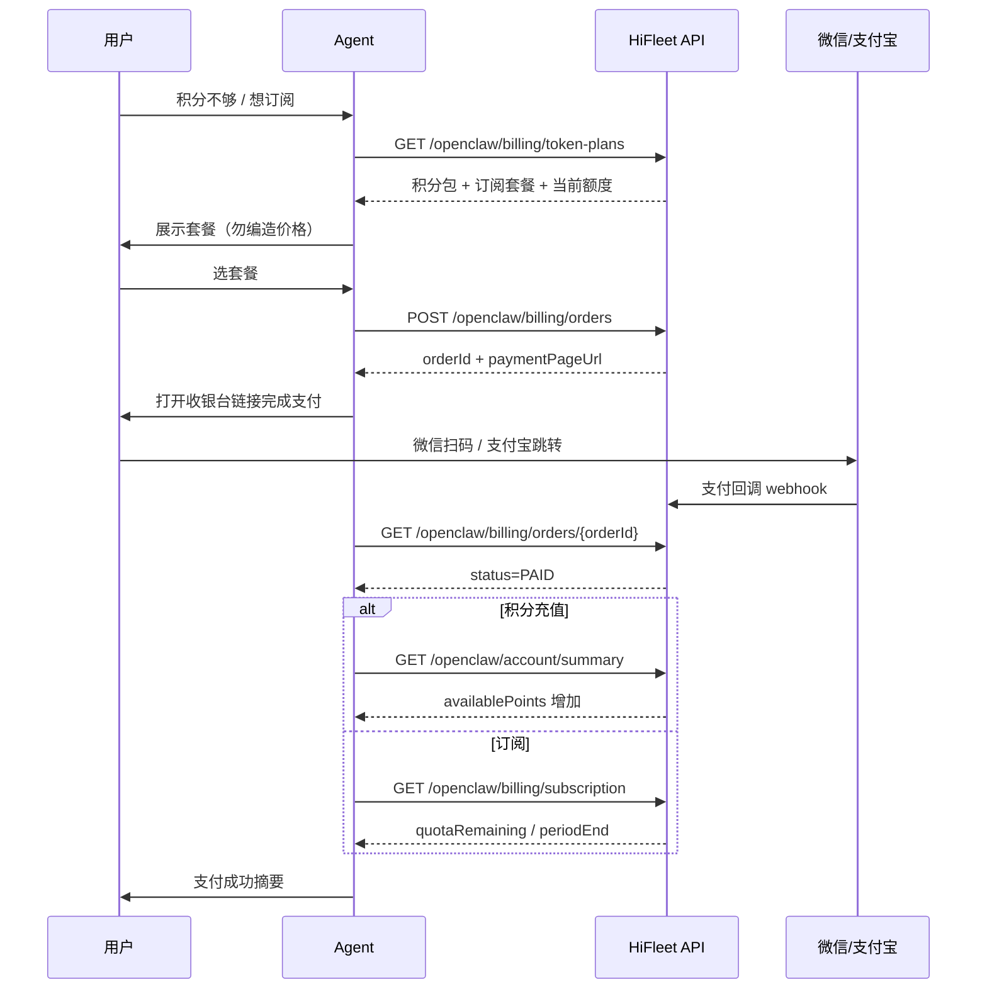

# 计费与发票 API / Billing & Invoice API

> **状态**：**已实现**  
> **计费模式**：**混合计费**——订阅用户优先消耗**周期额度**（周/月），额度用尽后可使用**充值积分**（可开关）；无订阅用户仅使用充值积分。  
> **支付**：下单返回 **`paymentPageUrl`**（收银台页），用户可在页内选择**微信扫码**或**支付宝**。**不支持自动扣费续费**；订阅到期前会邮件提醒（约 7/3/1 天），用户须**手动续费**。  
> **前置**：用户须已注册并持有 `api_key`，见 [account_onboarding_api.md](account_onboarding_api.md)。

**API 基址**：`{base}`（默认 `https://api.hifleet.com`）。

**鉴权方式**（二选一）：

| 方式 | 适用 |
|------|------|
| `api_key`（Query / Header `x-api-key` / Bearer） | OpenClaw Agent 主路径；与业务接口一致 |
| `Authorization: Bearer {accessToken}` | Web 控制台、需更高权限的操作（如修改发票抬头） |

**响应约定**：成功时 `status` 为 **`"1"`**（`HiResult`）；失败时 `status` 为 `"0"` 并带 `code` / `msg`。

**用户控制台**：`https://skills.hifleet.com/openclaw/console.html#/plans`（套餐与订阅；也可换票进入，见 [console_sso_api.md](console_sso_api.md)）  
**收银台页面**：完整 URL 以订单响应中的 **`paymentPageUrl`** 为准（拼接 `{base}` 如需要）

---

## 全链路概览



---

## Agent 路由（必守）

| 用户意图 | 接口 | 说明 |
|----------|------|------|
| 套餐、订阅、多少钱、Token Plan | `GET /openclaw/billing/token-plans` | **首选**：一次返回积分包 + 月付/年付订阅 + 当前额度 |
| 仅查积分充值包 | `GET /openclaw/billing/packages` | 兼容旧路径，仅积分包 |
| 买积分包 | `POST /openclaw/billing/orders` Body `orderType=POINTS` + `packageId` | 返回 `paymentPageUrl` |
| 买订阅（包月/包年） | `POST /openclaw/billing/orders` Body `orderType=SUBSCRIPTION` + `planId` + `billingCycle` | `billingCycle`: `MONTHLY` / `ANNUAL` |
| 付了吗、订单状态 | `GET /openclaw/billing/orders/{orderId}` | `PENDING` / `PAID` / `EXPIRED` / `FAILED` |
| 我的订阅、还剩多少额度 | `GET /openclaw/billing/subscription` | 含 `quotaRemaining`、`periodEnd` |
| 取消订阅 | `POST /openclaw/billing/subscription/cancel` | 当前周期仍可用至 `periodEnd`；**不自动续费** |
| 额度用尽后是否用充值积分 | `PUT /openclaw/billing/subscription/over-quota?allow=true/false` | 默认开启 |
| 到账了吗（积分） | `GET /openclaw/account/summary` + `transactions` | 订阅额度看 `billing/subscription` |
| 发票、开票 | `GET/POST /openclaw/billing/invoices` | 仅 `PAID` 订单可开票 |
| 申请退款 | `POST /openclaw/billing/orders/{orderId}/refund` | 视订单类型与规则处理 |

**积分不足入口**：业务接口返回 `code=4021` 或 `summary.availablePoints <= 0` 时，先调 `billing/subscription` 确认是否为**周期额度用尽**；再引导充值积分或续订。详见 [account_onboarding_api.md](account_onboarding_api.md) §3。

**禁止**：

- 编造价格、套餐 ID 或付款链接  
- 声称「已自动续费扣款」——当前仅邮件提醒 + 手动下单续费  
- 下单时硬编码 `paymentChannel: WECHAT`——应让用户在收银台页自选渠道  

---

## 0. Token Plan 统一套餐页（推荐）

| 项目 | 值 |
|------|-----|
| URL | `{base}/openclaw/billing/token-plans` |
| 方法 | `GET` / `POST` |
| 鉴权 | `api_key` 或 `accessToken`（有用户身份时附带当前余额与订阅） |

**Query（可选）**

| 参数 | 说明 |
|------|------|
| `locale` | `zh` / `en` |
| `tab` | `annual` / `monthly` / `points`，高亮对应 Tab |

**响应 `data` 主要字段**

| 字段 | 说明 |
|------|------|
| `title` | 页面标题 |
| `tabs[]` | Tab 列表：`annual`（连续包年）、`monthly`（连续包月）、`points`（积分） |
| `points.items[]` | 积分充值包（同 §1） |
| `points.validityNote` | 积分有效期说明（默认购买起 1 年） |
| `subscriptions.monthly.items[]` | 连续包月套餐 |
| `subscriptions.annual.items[]` | 连续包年套餐（通常立省 2 个月） |
| `currentBalance` | 当前充值积分余额（有鉴权时） |
| `currentSubscription` / `quota` | 当前订阅与周期额度（有鉴权时） |
| `agentSummary` | 自然语言摘要 |

**订阅套餐 `items[]` 单条字段**

| 字段 | 说明 |
|------|------|
| `planId` | 下单时使用，如 `plan_plus` / `plan_max` / `plan_ultra` |
| `name` | 套餐名称 |
| `billingCycle` | `MONTHLY` 或 `ANNUAL` |
| `quotaCycle` | 额度重置周期：`MONTHLY`（每月）或 `WEEKLY`（每周） |
| `price` / `priceDisplay` | 售价 |
| `originalPrice` / `originalPriceDisplay` | 划线价（可选） |
| `monthlyPoints` / `weeklyPoints` / `periodPoints` | 周期积分额度 |
| `maxApiKeys` | 建议并发 API Key 数 |
| `features[]` | 权益列表 |
| `usageHighlight` | 用量亮点文案 |
| `recommended` | 是否推荐 |

**默认订阅套餐（种子数据，管理端可改）**

| planId | 名称 | 月付参考价 | 周期额度（月） |
|--------|------|------------|----------------|
| `plan_plus` | Plus | ¥49 | 50,000 |
| `plan_max` | Max | ¥119 | 150,000 |
| `plan_ultra` | Ultra | ¥469 | 600,000 |

年付价为月付 ×10（约省 2 个月），以接口实时返回为准。

---

## 1. 积分充值套餐列表

| 项目 | 值 |
|------|-----|
| URL | `{base}/openclaw/billing/packages` |
| 方法 | `GET` / `POST` |
| 鉴权 | `api_key` 或 `accessToken` |

**响应 `data.items[]` 单条字段**

| 字段 | 说明 |
|------|------|
| `packageId` | 下单时使用 |
| `name` / `nameEn` | 套餐名称 |
| `points` / `bonusPoints` / `totalPoints` | 积分数量 |
| `price` / `currency` / `priceDisplay` | 价格 |
| `validityDays` | 有效期天数（默认 365） |
| `recommended` | 是否推荐 |
| `itemSummary` | 单条自然语言摘要 |

**默认积分包（种子数据）**

| packageId | 名称 | 积分 | 参考价 |
|-----------|------|------|--------|
| `pkg_entry` | 入门版 | 4,285 | ¥30 |
| `pkg_advanced` | 进阶版 | 21,430 | ¥150 |
| `pkg_premium` | 高级版 | 71,435 | ¥500 |

> 早期测试包 `pkg_starter` / `pkg_standard` / `pkg_pro` 已停用，以接口返回的 `ACTIVE` 套餐为准。

---

## 2. 创建订单（积分充值 / 订阅）

| 项目 | 值 |
|------|-----|
| URL | `{base}/openclaw/billing/orders` |
| 方法 | `POST` |
| Content-Type | `application/json` |
| 鉴权 | `api_key` 或 `accessToken` |

**请求 Body**

| 字段 | 必填 | 说明 |
|------|------|------|
| `orderType` | 否 | `POINTS`（默认）或 `SUBSCRIPTION` |
| `packageId` | 积分单必填 | 来自 §1 |
| `planId` | 订阅单必填 | 来自 §0，如 `plan_max` |
| `billingCycle` | 订阅单必填 | `MONTHLY` 或 `ANNUAL` |
| `paymentChannel` | 否 | **一般无需传**；用户于收银台页选择微信/支付宝 |
| `returnUrl` | 否 | 支付完成后浏览器跳转（Web 场景） |
| `clientType` | 否 | `WEB` / `MOBILE` / `AGENT` |

**积分充值示例**

```json
{
  "orderType": "POINTS",
  "packageId": "pkg_advanced",
  "clientType": "AGENT"
}
```

**订阅示例**

```json
{
  "orderType": "SUBSCRIPTION",
  "planId": "plan_max",
  "billingCycle": "MONTHLY",
  "clientType": "AGENT"
}
```

**成功响应 `data`**

| 字段 | 说明 |
|------|------|
| `orderId` | 订单号 |
| `orderType` | `POINTS` 或 `SUBSCRIPTION` |
| `status` | 初始为 `PENDING` |
| `packageId` / `planId` / `billingCycle` | 订单明细 |
| `packageName` | 展示名称 |
| `totalPoints` | 积分单为到账积分；订阅单为套餐参考额度 |
| `amount` / `currency` / `amountDisplay` | 应付金额 |
| `paymentPageUrl` | **首选**：完整收银台路径，如 `/openclaw/payment.html?orderId=oc_xxx` |
| `paymentUrls.page` | 同上 |
| `paymentUrls.wechat` | 直达微信 Tab |
| `paymentUrls.alipay` | 直达支付宝 Tab |
| `expiresAt` | 订单过期时间（通常 30 分钟） |
| `agentSummary` | 含付款指引的自然语言摘要 |

**失败响应**

| code | 说明 |
|------|------|
| `4201` | 邮箱未验证，须先验证再充值 |
| `4301` | 套餐/订阅计划不存在或已下架 |
| `4302` | 存在未支付订单，须先支付或等待过期 |
| `4303` | 支付渠道不可用 |

**Agent 话术（下单成功）**

> 已为您创建订单 **{orderId}**，应付 **{amountDisplay}**。  
> 请打开收银台完成支付（可选微信或支付宝）：  
> **{base}{paymentPageUrl}**  
> 支付完成后告诉我，我会帮您确认到账。

**禁止**伪造付款链接；`paymentPageUrl` 须来自接口响应。发给用户时拼接 `{base}` 为完整 URL。

---

## 3. 收银台与支付（用户侧）

Agent **一般不直接调** checkout API，而是把 `paymentPageUrl` 交给用户。页面流程：

1. 打开订单返回的完整 **`paymentPageUrl`**  
2. 展示订单摘要（金额、商品名）  
3. 用户选择 **微信支付**（展示二维码 + 步骤指引）或 **支付宝**  
4. 页面轮询 `GET /openclaw/billing/orders/{orderId}` 直至 `PAID`

**支付相关 API（页面或高级集成；Agent 一般只发 `paymentPageUrl`）**

| 操作 | URL | 说明 |
|------|-----|------|
| 收银台配置 | `GET /openclaw/billing/orders/{orderId}/checkout?paymentType=wechat\|alipay` | 返回二维码/跳转 URL 等 |
| 支付页 HTML | `GET /openclaw/billing/orders/{orderId}/pay?paymentType=...` | 支付页内容 |

---

## 4. 查询订单状态

| 项目 | 值 |
|------|-----|
| URL | `{base}/openclaw/billing/orders/{orderId}` |
| 方法 | `GET` / `POST` |
| 鉴权 | `api_key` 或 `accessToken` |

**订单状态**

| status | 含义 | Agent 动作 |
|--------|------|------------|
| `PENDING` | 待支付 | 重新发送 `paymentPageUrl` |
| `PAID` | 已支付 | 积分单查 `summary`；订阅单查 `billing/subscription` |
| `EXPIRED` | 已过期 | 建议重新下单 |
| `FAILED` | 支付失败 | 说明原因，建议重试 |
| `REFUNDED` | 已退款 | 查 `transactions` / 退款记录 |

**订单列表**：`GET {base}/openclaw/billing/orders?limit=20&status=PAID`

---

## 5. 订阅管理

### 5.1 当前订阅与周期额度

| 项目 | 值 |
|------|-----|
| URL | `{base}/openclaw/billing/subscription` |
| 方法 | `GET` / `POST` |
| 鉴权 | `api_key` 或 `accessToken` |

**`data.subscription` / `data.quota` 主要字段**

| 字段 | 说明 |
|------|------|
| `hasSubscription` | 是否有有效订阅 |
| `billingMode` | `POINTS_ONLY` 或 `HYBRID` |
| `planId` / `planName` | 当前套餐 |
| `billingCycle` | `MONTHLY` / `ANNUAL` |
| `quotaCycle` | 额度重置：`MONTHLY` / `WEEKLY` |
| `cycleQuotaLimit` | 本周期额度上限 |
| `quotaUsed` / `quotaRemaining` | 已用 / 剩余 |
| `quotaUsagePercent` | 使用百分比 |
| `quotaPeriodStart` / `quotaPeriodEnd` | 当前额度周期 |
| `periodEnd` | 订阅有效期截止（到期须手动续费） |
| `allowOverQuota` | 周期额度用尽后是否可用充值积分 |
| `purchasedBalance` | 充值积分余额 |
| `totalSpendable` | 当前可消耗总量（额度 + 可选充值积分） |
| `agentSummary` | 摘要 |

**混合扣费规则**：API 调用优先扣 **周期额度**；`allowOverQuota=true` 时额度用尽后扣 **充值积分**；无订阅时仅扣充值积分。

**额度预警**：使用达 80%/90%/100% 时邮件通知；订阅到期前 **7、3、1 天**邮件提醒续费（**非自动扣款**）。

### 5.2 取消订阅

| 项目 | 值 |
|------|-----|
| URL | `{base}/openclaw/billing/subscription/cancel` |
| 方法 | `POST` |
| Body | `{ "reason": "可选说明" }` |

取消后当前周期仍可用至 `periodEnd`；到期后不再续期，充值积分余额保留。

### 5.3 超额使用充值积分开关

| 项目 | 值 |
|------|-----|
| URL | `{base}/openclaw/billing/subscription/over-quota?allow=true` |
| 方法 | `PUT` / `POST` |

`allow=false` 时，周期额度用尽后 API 将因额度不足失败（`4021`），须等待下周期或充值积分（若重新开启）。

### 5.4 续费指引（Agent）

用户收到到期提醒邮件或主动询问续费时：

1. `GET /openclaw/billing/token-plans` 展示当前套餐与价格  
2. `POST /openclaw/billing/orders` 创建新的 `SUBSCRIPTION` 订单  
3. 发送 `paymentPageUrl` 完成支付  
4. 支付成功后新订阅替换旧订阅（`REPLACED`），额度按新周期重置  

**勿**承诺「到期自动扣款」或「免操作续费」。

---

## 6. 退款（可选）

| 操作 | URL | 方法 |
|------|-----|------|
| 申请退款 | `{base}/openclaw/billing/orders/{orderId}/refund` | `POST` |
| 查询退款 | `{base}/openclaw/billing/orders/{orderId}/refund` | `GET` |

订阅类订单退款规则较复杂，以接口返回的 `agentSummary` 与 `refundStatus` 为准。

---

## 7. 发票

### 7.1 发票抬头

| 操作 | URL | 方法 |
|------|-----|------|
| 查询 | `GET {base}/openclaw/billing/invoice-profile` | |
| 保存 | `PUT {base}/openclaw/billing/invoice-profile` | |

### 7.2 申请开票

`POST {base}/openclaw/billing/invoices` Body：`{ "orderId": "..." }`  
仅 **`PAID`** 且未开票的订单可申请（积分充值与订阅订单均可，以 `invoiceStatus=AVAILABLE` 为准）。

### 7.3 列表 / 详情 / 下载

| 操作 | URL |
|------|-----|
| 列表 | `GET {base}/openclaw/billing/invoices?limit=20` |
| 详情 | `GET {base}/openclaw/billing/invoices/{invoiceId}` |
| 下载 PDF | `GET {base}/openclaw/billing/invoices/{invoiceId}/download` |

---

## 8. 到账确认（Agent）

Agent **不要**调用支付回调。用户付款后：轮询 `orders/{orderId}` 直至 `PAID`，或用户确认已付后再查余额/订阅。

**积分充值**：

```bash
curl -s "{base}/openclaw/account/summary" -H "x-api-key: $HIFLEET_API_KEY"
curl -s -G "{base}/openclaw/account/transactions" -H "x-api-key: $HIFLEET_API_KEY" --data-urlencode "limit=5"
```

**订阅**：`GET {base}/openclaw/billing/subscription`，确认 `hasSubscription=true` 且 `quotaRemaining > 0`。

`summary` 中若有 `subscriptionQuota`，可一并引用；向用户说明余额时仍以 **`availablePoints`** 为主（已含混合计费后的可调用量）。

---

## 9. 错误码汇总

| code | 场景 |
|------|------|
| `4021` | 积分/额度不足（业务接口） |
| `4201` | 邮箱未验证，不可下单 |
| `4301` | 套餐/计划不存在 |
| `4302` | 重复未支付订单或订单不可支付 |
| `4303` | 支付渠道不可用 |
| `4401` | 订单/发票不存在或未支付 |
| `4402` | 重复开票 |
| `4403` | 抬头不完整 |
| `4404` | 开票处理中 |
| `4501` | 无有效订阅（取消时） |
